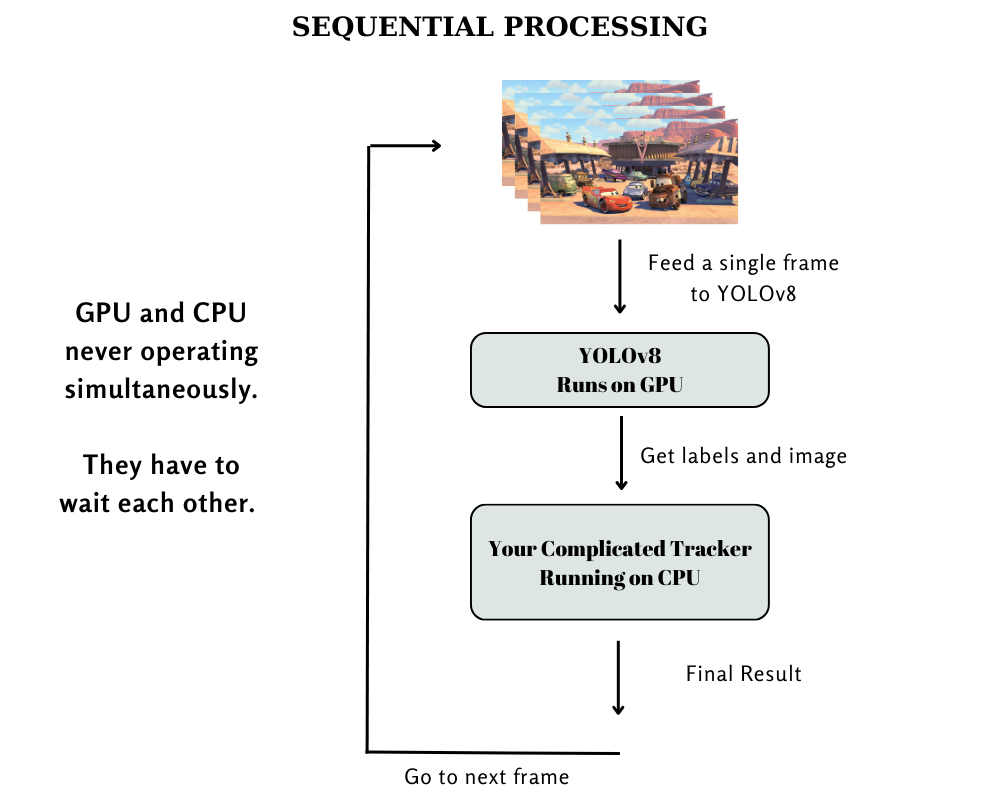
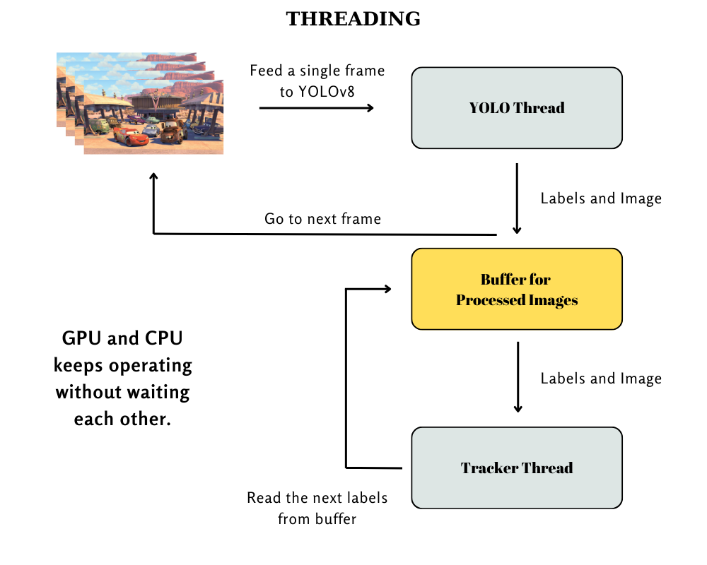

### What is Threading
Threading is a programming concept that allows multiple threads to be executed concurrently within a single process. 
This enables a program to perform multiple operations simultaneously, which can improve performance, responsiveness, and resource utilization.

### About This Repo
In this repository, I provide an example of constructing a threaded architecture to reduce processing time. 
The code is intentionally kept simple and serves as a straightforward demonstration of threading concepts, 
aimed at explaining how threading can be implemented effectively.

### Preparation
To run this repository, you will need to have OpenCV and YOLO installed.
```bash
pip install opencv-python
pip install ultralytics # Installs YOLO
```
Prepare your favorite video in MP4 format to run this example. Make sure to modify the path information in both [sequential.py](sequential.py) and [threaded.py](threaded.py)
```python
path_to_input_video = ".../<video_name>.mp4"  # path to your favorite video
```

### Toy Example
To help illustrate the concept, we will focus on a toy example. 
Imagine you want to implement a visual tracker using [YOLO](https://docs.ultralytics.com/). YOLO detects objects in an image frame, 
and then a tracker processes the labels and bounding boxes to track individual objects within the scene.


It’s important to note that we are not implementing a tracker in this example. However, to simulate the time utilized by the tracker, I have included a sleep function to represent the processing time taken by the tracker. This will help us understand the overall timing and performance impact of threading.
```python
time.sleep(0.01) # represent the time required for your complicated tracker
```
    
### Sequential Implementation
Let's first examine how a sequential implementation operates in this scenario. In a sequential implementation, threading is not utilized; instead, the system operates on a single thread. As shown in the figure below, a frame is first fed to YOLO, which processes the data on the GPU. Afterward, the results are sent to the tracker.




In this sequential approach, when the GPU is processing the data, the CPU must wait for the completion of that task. Conversely, when the CPU is processing the data, the GPU has to wait. This results in inefficiencies, as both the CPU and GPU are idly waiting at different stages of the processing pipeline.

### Threaded Implementation
Now, let's examine the threaded implementation. I have implemented two threads: the first thread is dedicated to YOLO, which continuously reads image frames and saves the results in a buffer using YOLO. The second thread, the Tracker thread, directly reads from the buffer and utilizes the results to perform tracking.



This approach allows the GPU and CPU to work concurrently without waiting for each other. While the GPU processes the next frame, the CPU can simultaneously process the results of the current frame. This enhances the overall efficiency and performance of the system by minimizing idle time for both the GPU and CPU.

### IMPORTANT
Don't forget to compare the elapsed time for both implementations. This will help you assess the performance improvements gained through the threaded architecture versus the sequential approach.
